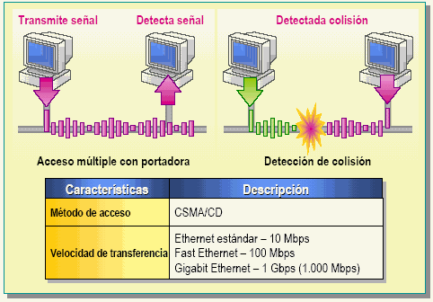

# Capa de acceso a la red 

Prepara los datos para enviarlos a traves de los medios locales.

## Funciones principales

- Permite a las capas superiores acceder a los medios usando tecnicas, como tramas.
- Controla cómo los datos se ubican en los medios y son recibidos desde los medios usando tecnicas de control de acceso a los medios y detección de errores. 

## Terminos

- Trama: PDU de la capa 2

- Nodo: los dispositivos concectados a un medio común

- Medios: medios fisicos para la transferencia de información ente 2 nodos

- Red: 2 o mas nodos conectados a un medio común

## Acceso al medio de la capa superior

Las tramas seran desempaquetadas y vueltas a construir cada vez que crucen por dispositivos que operan a nivel de capa 3.

**las tecnicas para colocar y sacar paquetes encapsulados en cada medio se le denomina tecnicas de control de acceso al medio.**

## Creación de una trama

la capa de enlace de datos requiere información de control para permitir que los protocolos funcionen. La información de control puede indicar: 

- Qué nodos estan en comunicación con otros
- Cuando comienza y cuando termina la comunicación entre nodos individuales.
- Qué errores se producen mientras los nodos se comunican.

## Formateo de datos de la trama para la transmision

Cuando los datos viajan a traves de diferentes medios, se envian streams de bits en 1 y 0. Pero ... , ¿ Como se determina dónde comienza y termina la trama o que bits representan una dirección ? , el tramado utiliza agrupaciones decifrables que comunmente incluyen los campos tipicos de:

- Campos indicadores de comienzo y fin de una trama.
- Campo tipo de PDU que contiene la trama.
- Calidad: campo de control
- Campo de datos (carga util)

## Subcapas de enlace de datos

La capa de enlace de datos se divide en 2 subcapas:

- Subcapa superior LLC: define los procesos de software para la transmision de datos (entrama el paquete e identifica el protocolo de la capa de red)
- Subcapa inferior MAC: define los procesos realizados por el hardware (direccionamiento fisico, condificación)

## Control de acceso al medio 

Son las reglas que se utilizan para colocar o sacar datos de un medio.

Hay varios metodos de control de acceso a los medios que dependen de la **topología y si se comparten los medios**

##  Control de acceso al medio para medios compartidos

topologias en las que un mismo medio es cmpartido con varios nodos 

## Acceso controlado para medios compartidos

Los dispositivos de red toman turnos par enviar datos. 

## Acceso por contención para medios compartidos

Los dispositivos compiten por el uso del medio, solo con la condicion de monitorear el medio buscando detectar una señal portadora, si detecta una señal portadora entonces esperara un periodo de tiempo corto para utilizar e medio, si no detecta una señal portadora utiliza el medio.

Para evitar el gran caos se utilizan metodos de deteccion de portadora (CSMA)

Si CSMA falla debido a que 2 dispositivos envian datos al mismo tiempo, sucedera una colisión de datos lo que provocaria el reenviar los datos.

## CSMA/CD (detección de colisión)

En CSMA/CD es usada por las formas tradicionales de ethernet, el dispositivo monitorea los medios para detectar una señal portadora, si la encuentra una señal todos los dispositivos dejan de enviar datos y esperan un periodo de tiempo corto.

## CSMA/CA (prevención de colisiones)

En CSMA/CA es usada por tecnologías de redes inhalambricas 802.11, el dispositivo examina los medios para detecar una señal portadora , si el medio esta libre el dispositivo envia una señal comunicando su intencion de utilizar el medio y posteriormente envia los datos.

## Control de acceso al medio para medios no compartidos

Los protocolos de control de acceso para medios no compartidos requieren poco o ningún control antes de colocar tramas en los medios. Estos protocolos tienen reglas y procedimientos más simples para el control de acceso al medio. Tal es el caso de las topologías punto a punto.

## Full Duplex

Ambos extremos pueden enviar datos al mismo tiempo.

## Half Duplex

Se pueden enviar datos hacia ambos extemos pero uno a la vez.

# Topologías 

## Topología Física

Son las conexiones fisicas entre nodos.

Entre las mas conocidas tenemos:

## Topologias logicas

Es la forma en la que una red transfiere tramas de un nodo al siguiente, toma en cuenta las conexiones virtuales independientemente de su distribución fisica.

## Topología punto a punto

Es la tipología más sencilla porque solo consiste en la conexión directa de dos terminales mediante dispositivos intermedios, formando un túnel virtual en donde el medio está disponible solo para los dos hosts. 

## Topología de acceso multiple

Esta tipología se caracteriza por que todos los equipos comparten el mismo medio, escuchando las peticiones lanzadas desde cualquier equipo. Para lograr una eficiente comunicación cada equipo tiene una dirección MAC ( Media Access Control ), que sirve para identificar cual es el equipo fuente y cuál es el equipo destino, si un equipo recibe una petición pero no pertenece a el, pues no responderá. El ejemplo más común es ethernet.

## Topología en anillo

Cada equipo al recibir ese token tiene derecho a enviar datos por la red, si no tiene nada que enviar sencillamente envía el token al siguiente equipo. Una red que utiliza este sistema de transmisión es Token Ring

## Encabezado trama

- Indicadores de inicio y finalización de trama (Start/Stop): se utilizan para identificar los límites inicial y final de la trama.
- Direccionamiento (Addressing): indica los nodos de origen y destino en los medios.
- Tipo (Type): identifica el protocolo de capa 3 en el campo de datos.
- Control: identifica servicios especiales de control de flujo, como la calidad de servicio (QoS). QoS otorga prioridad de reenvío a ciertos tipos de mensajes. Por ejemplo, las tramas de voz sobre IP (VoIP) normalmente reciben prioridad porque son sensibles al retraso.
- Datos (Data): contiene la carga útil de la trama (es decir, el encabezado del paquete, el encabezado del segmento y los datos).
- Detección de errores (Error Detection): se incluye después de los datos para formar el avance.

## Protocolo ARP

El protocolo de resolución de direcciones (Address Resolution Protocol, ARP) es un protocolo o procedimiento que conecta una dirección de protocolo de Internet (IP) en constante cambio a una dirección de máquina física fija, también conocida como dirección de control de acceso a medios (media access control, MAC), en una red de área local (local-area network, LAN). 

## ¿ Comó funciona ARP ?

El dispositivo primero comprueba su caché ARP para comprobar si tiene la dirección MAC del dispositivo de destino.

Si se encuentra el detalle de la asociación IP–MAC del dispositivo de destino, el dispositivo utiliza este detalle para establecer comunicación con el dispositivo de destino.

Si no se encuentra el detalle de la asociación IP–MAC del dispositivo de destino, el dispositivo debe identificar primero la dirección MAC del dispositivo de destino. Para ello:

    El dispositivo que desea establecer la comunicación transmite un paquete de solicitud ARP en la red, solicitando la dirección MAC del dispositivo con la dirección IP especificada.
    El paquete de solicitud ARP contiene la dirección IP del dispositivo de destino y la dirección MAC del dispositivo de envío.
    On receiving a ARP request broadcast packet, network devices compare the IP address in the packet with their own IP address.
    Al recibir un paquete de difusión de solicitud ARP, los dispositivos de red comparan la dirección IP del paquete con su propia dirección IP.
    El dispositivo cuya dirección IP coincide con la IP de la solicitud ARP envía un paquete de respuesta ARP al dispositivo solicitante. El paquete de respuesta ARP contiene la dirección MAC del dispositivo que envió la respuesta.
    El dispositivo solicitante, al recibir el paquete de respuesta ARP con el detalle de la asociación IP–MAC, utiliza esta información para enviar datos directamente al dispositivo de destino.

## ejercicios 

Todas la interfaces tienen la IP y MAC con el mismo nombre del dispositivo

1. Si se envia un paquete desde la PC D al seervidor I, que direccion IP de origen y destino llegara al servidor
2. Si se envia un paquete desde la interfaz P hacia V, que direccion MAC de origen y destino envia el router P
3. Si se envia un paquete desde la PC A hacia el servidor H, que direccion IP de origen/destino y que dirección MAC de origen/destino enviara la PC a.
4. Si se envia un paquete desde la interfaz V hacia la interfaz T, que direccion IP de origen/destino y que dirección MAC de origen/destino recibira el router T

# Capa fisica

La capa física define las especificaciones eléctricas, mecánicas, de procedimiento y funcionales para activar, mantener y desactivar el enlace físico entre sistemas finales. **El objetivo de la capa fisica es crear señales que representen los bits de cada trama**

El envio de tramas a traves de los medios requiere los siguientes elementos de la capa fisica:

- Medios fisicos y conectores.
- Una representación de los bits en los medios.
- Codificación de los datos y de la información de control.
- Sistema de circuitos del receptor y transmisor en los dispositivos de red.

Funciones de a capa fisica:

- Los componentes fisicos
- Codificación
- Señalización

## Representacion de los bits

## Señalización NRZ (Sin retorno a cero)

Un '1' se representa con un nivel de voltaje alto y un '0' se representa con un nivel de voltaje bajo, como ejemplo 10110 en señalización NRZ seria:

## Señalización Manchester

cada bit se representa por una transición de nivel en el medio del período de bit. Un '1' se representa con una transición de bajo a alto en el medio del período de bit, mientras que un '0' se representa con una transición de alto a bajo en el medio del período de bit.
Ejemplo: Datos binarios: 10110
Señal Manchester: 

## Patrones de señales y grupos de codigos

Los patrones de señalesrepresentatn los bits que pueden indicar: el comienzo y fin de la trama o el contenido de una trama, los patrones de inicio y fin no se entraman, son ignorados por la capa fisica.

Los grupos de codigos son esas secuencias de bits que estan dentro de los patrones, tales como 11000 representa el inicio de un frame y 01101 el final de un frame.

## Ancho de banda vs Rendimiento vs transferencia util

ancho de banda: cantidad de datos que se pueden transmitir en un medio de comunicación (cable, fibra óptica, aire, etc.) en una determinada unidad de tiempo.Se mide en bits por segundo (bps)

rendimiento: cantidad real de datos transferidos con éxito en un medio de comunicación en una determinada unidad de tiempo, se debe a que un solo segmento en toda la comunicación puede causar un cuello de botella. Se mide en bits por segundo (bps)

Transferencia util: cantidad de datos útiles efectivamente entregados al destinatario en una determinada unidad de tiempo entre entidades de la capa de aplicación. Se mide en bits por segundo (bps)

## Cables UTP

