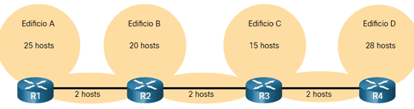

# VLSM - Actividad 2

## Contenido

1. [Introducción-a-VLSM](#section-1)
2. [EjerciciosVLSM](#section-2)
3. [Calculo-de-VLSM-diseño-direccionamiento-basico](#section-3)
4. [Bibriografi](#section-4)

## Objetivos

- Determinar la cantidad de subredes necesarias.
- Determinar la cantidad de hosts necesarios para cada subred.
- Diseñar un esquema de direccionamiento adecuado utilizando VLSM.
- Asignar direcciones y pares de mascaras de subred a las interfaces del dispositivo.
- Examinar el uso del espacio de direcciones de red disponible.

## 1 Introducción a VLSM (Variable Length Subnet Mask)

No todas las subredes que cree necesitarán tantos hosts, dejando muchas direcciones IPv4 sin usar. Quizás necesites una subred que contenga muchos menos hosts. Esta es la razón por la cual se desarrolló la máscara de subred de longitud variable (VLSM). Los bloques de direcciones de tamaño fijo son ineficientes, pero mejor lo veremos con un ejemplo.

**Observe la siguiente topología**
Vera los requisitos de host que cada subren necesita.

Este texto estará resaltado en rojo

Si realizamos este proceso con subneting tendriamos este resultado:

1. Tenemos la dirección 192.168.19.34/24
2. Hallamos la dirección de red usando el proceso **anding** -> 192.168.19.0 máscara: 255.255.255.0
3. utilizamos la formula 2^n-2 = # de subredes (combinaciones en n bits)
4. La formula para cumplir los requisitos en cuanto a la cantidad de direcciones de red que necesitamos: 2^n>= #subredes solicitadas
5. 2^n>=7 subredes que son las necesarias para esta tarea y solo si n=3 se cumplira la condición de la cantidad de host necesarios, tendriamos 8 subredes nuevas con #hosts = 2^5-2, con 5 como la cantidad de bits que ocupan la porción de host.
   Y 30 host disponibles.
6. Nos centramos en el ultimo objeto, donde la mascara de subred tiene la porción de red sujeta a las reglas del subneting.

| subred | direccion de red /prefijo | 1er IPv4      | ultima IPv4    | direccion de broadcast | #hosts | #host no utilizados |
| ------ | ------------------------- | ------------- | -------------- | ---------------------- | ------ | ------------------- |
| A      | 192.168.19.0 /27          | 192.16.19.1   | 192.168.19.254 | 192.16.19.253          | 30     | 5                   |
| B      | 192.168.19.30 /27         | 192.16.19.31  | 192.168.19.254 | 192.16.19.253          | 30     | 10                  |
| C      | 192.168.19.60 /27         | 192.16.19.61  | 192.168.19.254 | 192.16.19.253          | 30     | 15                  |
| D      | 192.168.19.90 /27         | 192.16.19.91  | 192.168.19.254 | 192.16.19.253          | 30     | 2                   |
| E      | 192.168.19.120 /27        | 192.16.19.121 | 192.168.19.254 | 192.16.19.253          | 30     | 28                  |
| F      | 192.168.19.150 /27        | 192.16.19.151 | 192.168.19.254 | 192.16.19.253          | 30     | 28                  |
| G      | 192.168.19.180 /27        | 192.16.19.181 | 192.168.19.254 | 192.16.19.253          | 30     | 28                  |
| H      | 192.168.19.210 /27        | 192.16.19.211 | 192.168.19.254 | 192.16.19.253          | 30     | 28                  |

Aunque esta división en subredes tradicional satisface las necesidades de la LAN más grande (D) y divide el espacio de direcciones en un número adecuado de subredes, resulta en un desperdicio significativo de direcciones no utilizadas.  
Por ejemplo, solo se necesitan dos direcciones en cada subred para los tres enlaces WAN. Debido a que cada subred tiene 30 direcciones utilizables, hay 28 direcciones no utilizadas en cada una de estas subredes. Como se muestra en la imagen, esto da como resultado 84 direcciones no utilizadas (28×3) y en las subredes A, B, C y D tenemos un total 32 host no utlizados pero a diferencia de las redes WAN estas pueden estar resevadas para un futuro.

En todos los ejemplos de subredes anteriores, se aplicó la misma máscara de subred para todas las subredes. Esto significa que cada subred tiene el mismo número de direcciones de host disponibles. Las subredes tradicionales crean subredes de igual tamaño. Cada subred en un esquema tradicional usa la misma máscara de subred. Como se muestra en el lado derecho de la imagen, VLSM permite que un espacio de red se divida en partes desiguales. Con VLSM, la máscara de subred variará dependiendo de cuántos bits de la porció de host se hayan prestado para una subred particular, por lo tanto, la parte “variable” del VLSM.

Si analizamos las redes de conexión entre las interfaces WAN solo neceitan 2 hosts, con la formula 2^n-2= #hosts, con n= 2, tendriamos que tenemos 2 hosts disponibles al costo de usar solo 2 bits en la porción de host, de esta forma nos queda una distribución de direcciones de red mas optimizada.

Si queremos resolver el ejercicio iremos siguiendo la jerarquia, empezando a subnetear nuestra dirección de red con la dirección de red con requisitos de host mas grande y terminaremos con la red con requisitos de host mas pequeña.

**Una vez mas**

Paso a paso:

1. Con la direccion de red direcctamente la **192.168.19.0/24**
2. Ordenamos los requisitos de redes de mayor a menor cantidad de host solicitadas:
   - Red D con 28 hosts
   - Red A con 25 hosts
   - Red B con 20 hosts
   - Red C con 14 hosts
   - Red WAN1 con 2 hosts
   - Red WAN2 con 2 hosts
   - Red WAN3 con 2 hosts
3. Vamos a por la primera Red D, usamos la formula:

> 2^n-2>=28; solo se cumple si n= 5

tendriamos 30 hosts de los 28 solicitados.

4. Como vimos en la anterior actividad, **solo es necesario trabajar en el octeto en el que no todos los bits serán conformados por 1 binario o 0 binario, en este caso el 4to octeto**, porque con n= 5 nos indica usar solo 5 bits para asignar en nuestra nueva subred y debe ser el menor valor de **n** que satisfaga la condición.

> 192.168.19.00000000

> dir red 192.168.19.000|00000 # la nueva mascara de subred es = /32-5=> /27

> dir broadcast 192.168.19.000|11111

En decimal esto representa:

> dir red 192.168.19.0 / 27

> dir broadcast 192.168.19.31

A la dirección de broadcast en la que nos ubicamos ahora le sumamos tan solo un uno binario

> broadcast 192.168.19.000|11111

-

> 00000000.00000000.00000000.00000001

> resultado: 192.168.19.32

Este representa la siguiente red, vera que **en la mayoria de los casos basta con sumar uno en el formato decimal**, exactamente en los casos en los que la suma binaria solo afecta a un octeto, si se da el caso de que afecte a otro octeto esta afirmación no es valida.

Repetiremos este proceso con todas las demas redes

Red A

Requisitos:

> 2^n-2>=25; solo si n= 5

Analizando con binario

> dir red 192.168.19.001|00000 /27

> dir bro 192.168.19.001|11111

En decimal

> dir red 192.168.19.32 / 27

> dir bro 192.168.19.63

Siguiente red:

> broadcast 192.168.19.001|11111

-

> 00000000.00000000.00000000.00000001

> resultado: 192.168.19.64

**Siguiente red: 192.168.19.64**

Red B

Requisitos:

> 2^n-2>=20; solo si n= 5

Analizando con binario

> dir red 192.168.19.010|00000 /27

> dir bro 192.168.19.010|11111

En decimal

> dir red 192.168.19.64 / 27

> dir bro 192.168.19.95

Siguiente red:

> broadcast 192.168.19.010|11111

-

> 00000000.00000000.00000000.00000001

> resultado: 192.168.19.96

**Siguiente red: 192.168.19.96**

Red C

Requisitos:

> 2^n-2>=14; solo si n= 4

Analizando con binario

> dir red 192.168.19.0110|0000 /28

> dir bro 192.168.19.0110|1111

En decimal

> dir red 192.168.19.96 / 28

> dir bro 192.168.19.111

Siguiente red:

> broadcast 192.168.19.0110|1111

-

> 00000000.00000000.00000000.0000001

> resultado: 192.168.19.112

**Siguiente red: 192.168.19.112**

Red WAN 1

Requisitos:

> 2^n-2>=2; solo si n= 2

Analizando con binario

> dir red 192.168.19.011100|00 /30

> dir bro 192.168.19.011100|11

En decimal

> dir red 192.168.19.112 / 28

> dir bro 192.168.19.115

Siguiente red:

> broadcast 192.168.19.01110011

-

> 00000000.00000000.00000000.0000001

> resultado: 192.168.19.116

**Siguiente red: 192.168.19.116**

Porque me detuve aqui :expressionless:
Bueno se dara cuenta que cuando tenemos una mascara 30 solo debemos hallar la direccion de red, sumamos una unidad y hallamos la 1er ip utilizable, sumamos otra unidad y hallamos la ultima ip utlizable y sumamos una y hallamos la dirección de broadcast, incluso si sumamos una a esta dirección de broadcast tendremos la siguiente red.

| subred | direccion de red /prefijo | 1er IPv4      | ultima IPv4    | direccion de broadcast | #hosts |
| ------ | ------------------------- | ------------- | -------------- | ---------------------- | ------ |
| D      | 192.168.19.0 / 27         | 192.16.19.1   | 192.168.19.254 | 192.168.19.31          | 30     |
| A      | 192.168.19.32 / 27        | 192.16.19.33  | 192.168.19.62  | 192.168.19.63          | 30     |
| B      | 192.168.19.64 / 27        | 192.16.19.65  | 192.168.19.94  | 192.168.19.95          | 30     |
| C      | 192.168.19.96 / 28        | 192.16.19.97  | 192.168.19.110 | 192.168.19.111         | 30     |
| WAN1   | 192.168.19.112 /27        | 192.16.19.113 | 192.168.19.114 | 192.16.19.115          | 30     |
| WAN2   | 192.168.19.116 /27        | 192.16.19.117 | 192.168.19.118 | 192.16.19.119          | 30     |
| WAN3   | 192.168.19.120 /27        | 192.16.19.121 | 192.168.19.122 | 192.16.19.123          | 30     |

## 2. Ejercicios VLSM

a)
Dada la red 192.168.0.0/24, desarrolle un esquema de direccionamiento que
cumpla con los siguientes requerimientos. Use VLSM, es decir, optimice el
espacio de direccionamiento tanto como sea posible.

1. Una subred de 20 hosts para ser asignada a la VLAN de Profesores
2. Una subred de 80 hosts para ser asignada a la VLAN de Estudiantes
3. Una subred de 20 hosts para ser asignada a la VLAN de Invitados
4. Tres subredes de 2 hosts para ser asignada a los enlaces entre routers.

| subred | direccion de red /prefijo | 1er IPv4 | ultima IPv4 | direccion de broadcast | #hosts |
| ------ | ------------------------- | -------- | ----------- | ---------------------- | ------ |
|        |                           |          |             |                        |        |
|        |                           |          |             |                        |        |
|        |                           |          |             |                        |        |
|        |                           |          |             |                        |        |
|        |                           |          |             |                        |        |
|        |                           |          |             |                        |        |
|        |                           |          |             |                        |        |

b)
Dada la siguiente dirección de red: 172.25.0.0/16, dividala en
subredes de las siguientes capacidades:

- 2 subredes (A y B) de 1000 hosts
- Una subred C de 2000 hosts
- Una subred D de 5 hosts
- Una subred E de 60 hosts
- Una subred F de 70 hosts
- Dos subredes de 2 hosts

| subred | direccion de red /prefijo | 1er IPv4 | ultima IPv4 | direccion de broadcast | #hosts |
| ------ | ------------------------- | -------- | ----------- | ---------------------- | ------ |
|        |                           |          |             |                        |        |
|        |                           |          |             |                        |        |
|        |                           |          |             |                        |        |
|        |                           |          |             |                        |        |
|        |                           |          |             |                        |        |
|        |                           |          |             |                        |        |
|        |                           |          |             |                        |        |

c) Dada la red 192.168.12.0/24, desarrolle un esquema de direccionamiento
usando VLSM que cumpla los siguientes requerimientos:

- Una subred de 60 hosts para la Red de Mercadeo
- Una subred de 80 hosts para la Red de Ventas
- Una subred de 20 hosts para la Red de Administrativos
- Dos subredes de 2 hosts para los enlaces entre enrutadores

| subred | direccion de red /prefijo | 1er IPv4 | ultima IPv4 | direccion de broadcast | #hosts |
| ------ | ------------------------- | -------- | ----------- | ---------------------- | ------ |
|        |                           |          |             |                        |        |
|        |                           |          |             |                        |        |
|        |                           |          |             |                        |        |
|        |                           |          |             |                        |        |
|        |                           |          |             |                        |        |
|        |                           |          |             |                        |        |
|        |                           |          |             |                        |        |

d)
Vamos a crear una red para el aula. Emplearemos la red privada 172.16.0.0, con máscara
255.255.0.0. Las especificaciones son las siguientes:

- Habrán 4 subredes con un máximo de 14 hosts cada una, a las que llamaremos mesanet1,
  mesanet2, mesanet3 y mesanet4.
- Habrá una subred que se empleará para los enlaces de los routers que conectarán las subredes
  anteriores. Esta subred tendrá un máximo de 6 hosts, dedicados a enlaces entre routers.
- Reserva otra red más, que pueda utilizarse como zona donde ubicar servidores atacados desde el
  exterior.
- Considera también que cada una de las subredes mesanet, deberá contar en un futuro con una
  DMZ (zona desmilitarizada), que incluya servicios empleados por dicha subred y ocasionalmente
  por las otras mesanets. Por ello debes reservar la red correspondiente.

No sabemos de que modo va a crecer la red del aula, así que debes tener en cuenta esto en tu
diseño.
Realiza un diagrama indicando la lógica de red que vas a utilizar.
PARTE 2:
Una vez que tengas claro como vas a segmentar la red del aula, discute con el resto de tus
compañeros de mesa la solución.
PARTE 3:
Contrasta los diseños de red con los compañeros de las otras mesas del aula. Acuerda con ellos las
subredes que vais a utilizar en cada una de las mesas.

| subred | direccion de red /prefijo | 1er IPv4 | ultima IPv4 | direccion de broadcast | #hosts |
| ------ | ------------------------- | -------- | ----------- | ---------------------- | ------ |
|        |                           |          |             |                        |        |
|        |                           |          |             |                        |        |
|        |                           |          |             |                        |        |
|        |                           |          |             |                        |        |
|        |                           |          |             |                        |        |
|        |                           |          |             |                        |        |
|        |                           |          |             |                        |        |

### Bibliografía

[Configuración de direcciones IP y subredes únicas para nuevos usuarios](https://ccnadesdecero.es/vlsm-mascaras-subred-longitud-variable/)

[Cálculo de VLSM y diseño de direccionamiento básicos](https://es.scribd.com/document/643602961/Laboratorio-VLSM-3-docx)
