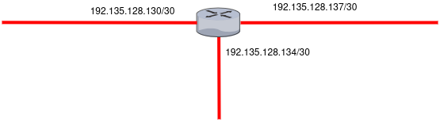

# Test capa de red

- ¿ Cuál es la dirección de gateway por defecto para el host A con dirección IPv4 192.135.128.138/30 en la siguiente topología?



El host A pertenece a la misma dirección que la direccion de la interfaz 192.135.128.137/30

- Cuando la red de destino no se encuentra en la lista de la tabla de enrutamiento de un router, ¿ cuáles son las 2 acciones posibles que el router podría realizar ? (elija dos)

a. El router reenvia el paquete a la interfaz indicada por la dirección de origen.
b. El router envía una solicitud de ARP para determinar la direccion del siguiente salto requerido
c. El router reenvía el paquete hacia el siguiente salto indicado en la tabla ARP.
d. El router reenvía el paquete a la interfaz indicada por la entrada de la ruta por defecto
e. El router descarta el paquete


Sol. d y e

- ¿ Cuál es un componente escencial de una entrada de una tabla de enrutamiento ?

a. Número de puerto de destino de la capa 4
b. La dirección de host de destino
c. Direccion MAC de la interfaz del router
d. La dirección del siguiente salto

Sol d
- ¿ Cúales son los factores clave que se deben tener en cuenta al agrupopa hosts en una red ?

a. gateway
b. ubicación geografica
c. Direccionamiento fisico
d. Proposito
e. Propiedad
f. Verdion del software

Sol b,d y e

- ¿ Qué información se agrega durante la encapsulacion en la capa 3 (capa de red)?

a. Protocolo de aplicaciones de origen y destino
b. Dirección IP de origen y destino
c. Número de puertos de origen y destino
d. MAC de origen y destino

- ¿ Qué campo del paquete IP evitará los bucles sin fin ?

a. Tipo de servicio
b. Señaladores 
c. Tiempo de vida
d. Identificación de señal

- ¿ Cuáles son las tres afirmaciones verdaderas sobre las rutas y su utilización ?

a. Si un host no tiene una ruta configurada en forma manual para la red de destino, el host descartara el paquete 
b. Si el host de origen tiene configurada un gateway por defecto, se puede reenviar el paquete para una red remota por mdion de esa ruta
c. Si se conecta la red de destino en forma directa, el router reenvía el paquete al host de destino.
d. Si no se encuentra ninguna ruta hacia la red de destino, se devuelve el paquete al router anterior.
e. Si existe varias entradas de red para la red de edstino, se utiliza la ruta mas general para reenviar el paquete.
f. Si no exite ninguna ruta para la red de destino y se presenta una ruta por defecto, se reenvia el paquete al router del siguiente salto.

sol b,c y f

- ¿ Qué porción de una dirección IP utliza un router para reenviar paquetes ?

a. Dirección de broadcast
b. Porcion de red
c. Porción de host
d. Direccion de gateway


sol b

- Si el gateway esta configurado de forma incorreca en el host, ¿cúal es el impacto sobre las comunicaicones ?

a. El host puede comunicarse con otros en redes remotaar pero no se puede comunicar con hosts de la red local
b. No hay impacto sobre las comunicaciones
c. El host puede comunicarse con oros hosts en la red local pero no se puede comunicar con hosts de redes remotas
d. El host no puede comunicarse en la red local

sol c

- ¿ Cúal es el proposito de una dirección gateway? 

a. Identificar la red con la cual está conectada una computadorea
b. Identifica la dirección lógica de una computadora conectada en red y la identifica de manera exclusiva con el resto de la red.
c. Dirección permanente a una computadora
d. Identifica al dispositivo que permite que se comuniquen computadoras de la red local con dispositivos de otras redes

sol d

- ¿ Cúales son los 3 problemas comunes que presenta una red de gran tamaño ?

a. Administración de direcciones
b. Compatibilidad de protocolos
c. Responsabilidad limitada de la administración
d. Problemas de seguridad
e. Muy pocos broadcast
f. Degradación del rendimiento

sol a,d y f

Descanso ... :sleeping:

Por el momento no olvidar que el comando: 

```bash
Windows> netsat -r
# mostrara la tabla de enrutamiento en nuestro dispositivo, si nuestro dispositivo tambien tienen una tabla de enrutamiento mayormente usada para hallar la direccion de gateway de una interfaz determinada
```

otros comandos necesarios 

```bash
# trazado de la ruta de un paquete
> tracert 
# enviar mensajes de estado
> ping [IP destino]
```

Devuelta a la acción :boom:

- ¿ Qué clase de enrutamiento utiliza información que se introduce a la tabla de enrutamiento de forma manual ?

a. Dimanica
b. Estatica

sol b

- ¿ Cúal es la opcióncorrecta para un sistema sinconexión ?

a. No se establece contacto con el destino antes de enviar un paquete.
b. El destino enva un acuse de recibo al origen solicitando envío del siguiente paquete
c. Se establece contacto con el destino antes de enviar un paquete 
d. El destino envia un ACK al origenindicando que se ha recibido el mansaje

sol a

- ¿Qué direcciones IPv4 puede usar un host para hacerle ping a la interfaz de bucle invertido?

a. 126.0.0.1
b. 127.0.0.0
c. 127.0.0.1
d. 126.0.0.0


sol c

- ¿Cuál es el motivo para la creación e implementación de IPv6?

a. Proporcionar más espacio de direcciones en el Registro de nombres de Internet
b. Permitir la compatibilidad NAT para la asignación de direcciones privadas
c. Facilitar la lectura de direcciones de 32 bits
d. Evitar que se agoten la direcciones IPv4

sol d

- Un administrador desea crear cuatro subredes de logitud de prefijo fija a partir de la dirección de red 192.168.1.0/24. ¿Cuál es la dirección de red y la máscara de subred de la segunda subred utilizable?

a. Subred 192.168.1.32
Máscara de subred 255.255.255.240

b. Subred 192.168.1.8
Máscara de subred 255.255.255.224

c. Subred 192.168.1.128
Máscara de subred 255.255.255.192

d. Subred 192.168.1.64
Máscara de subred 255.255.255.192

e. Subred 192.168.1.64
Máscara de subred 255.255.255.240

sol d

- ¿Cuántas direcciones de host se encuentran disponibles en la red 192.168.10.128/26?

a. 30
b. 32
c. 60
d. 62
e. 64

sol d

Otro descanso pero mensionando ... los tres metodos que permiten que IPv4 e IPv6 cohexistan en un mismo entorno
- Dual Stack: Paquetes IPv4 e IPV6 cohexisten en la misma red por medio de configuraciones adicionales.
- Tunelización: Un paquete IPv6 se transorta dentro de un paquete IPv4.
- Traducción: Los paquetes IPv6 se traducen a direcciones IPv4 y viceversa.


- ¿Cuántas direcciones de host están disponibles en la red 172.16.128.0 con la máscara de subred 255.255.252.0?

a. 510
b. 512
c. 1022
d. 1024
e. 2046
f. 2048

sol c

- Determine a cual grupo pertenecen las siguientes direcciones:

a. 192.168.100.161/25
b. 172.110.12.64/28
c. 10.10.10.128/25
d. 10.0.0.159/27
e. 203.0.113.100/24
f. 192.168.1.191/26

Sol  a y e direcciones de host, b y c direcciones de red, d y f direcciones de broadcast

- ¿Qué rango de prefijos de direcciones se reserva para las direcciones IPv4 de multidifusión?

a. 240.0.0.0 – 254.255.255.255
b. 169.254.0.0 – 169.254.255.255
c. 127.0.0.0 – 127.255.255.255
d. 224.0.0.0 – 239.255.255.255


sol d

- Un mensaje se envía a todos los hosts en una red remota. ¿Qué tipo de mensaje es?

a. Unicast
b. Multicast
c. Broadcast 

sol c

- ¿Qué tres direcciones son direcciones públicas válidas? (Escoja tres opciones).

a. 10.15.250.5
b. 198.133.219.17
c. 172.31.1.25
d. 128.107.12.117
e. 192.168.1.245
f. 64.104.78.227

sol b, d y f


### Bibliografía

- [test de la capa de red](https://www.daypo.com/capa-red-1.html#test)

- [examen de la capa de red studocu](https://www.studocu.com/ec/document/universidad-tecnica-particular-de-loja/redes-de-dispositivos/examen-aab01-cuestionario-1-diferenciar-los-distintos-tipos-de-direcciones-de-capa-de-red/60927019)

- [test de la capa de red cisco](https://examenredes.com/prueba-del-modulo-8-capa-de-red/)
