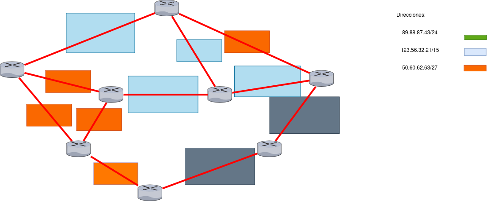
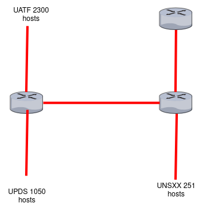
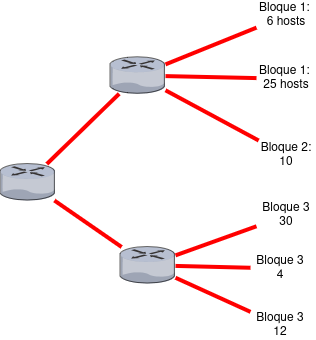

# test 2

## VLSM and subneting

### Subnetting escenario

Dado el siguiente escenario con las siguientes direcciones halle la forma de distriuir a cada una de estas redes de colores unicamente por medio de la longitud de mascara fija.
Dado el siguiente escenario con las siguientes direcciones halle la forma de distriuir a cada
color azul oscuro == verde

a) Subneting verde
89.88.87.44/24

| subred | direccion de red /prefijo | 1er IPv4     | ultima IPv4  | direccion de broadcast | #hosts |
| ------ | ------------------------- | ------------ | ------------ | ---------------------- | ------ |
| 1      | 89.88.87.0/25             | 89.88.87.1   | 89.88.87.126 | 89.88.87.127           | 62     |
| 2      | 89.88.87.128/25           | 89.88.87.129 | 89.88.87.254 | 89.88.87.255           | 62     |

b) Subneting celeste
123.56.32.21/15

| subred | direccion de red /prefijo | 1er IPv4     | ultima IPv4 | direccion de broadcast | #hosts |
| ------ | ------------------------- | ------------ | ----------- | ---------------------- | ------ |
| 1      | 123.56.0.0/17             | 123.56.0.1   | 123.56.0    | 123.56.127.255         | 32768  |
| 2      | 123.56.128.0/17           | 123.56.128.1 | 123.56.0    | 123.56.255.255         | 32768  |
| 3      | 123.57.0.0/17             | 123.57.0.1   | 123.56.0    | 123.57.127.255         | 32768  |
| 4      | 123.57.128.0/17           | 123.57.128.1 | 123.56.0    | 123.57.255.255         | 32768  |

c) Subneting naranja

| subred | direccion de red /prefijo | 1er IPv4    | ultima IPv4 | direccion de broadcast | #hosts |
| ------ | ------------------------- | ----------- | ----------- | ---------------------- | ------ |
| 1      | 50.60.62.32/30            | 50.60.62.33 | 50.60.62.34 | 50.60.62.35            | 2      |
| 2      | 50.60.62.36/30            | 50.60.62.37 | 50.60.62.38 | 50.60.62.39            | 2      |
| 3      | 50.60.62.40/30            | 50.60.62.41 | 50.60.62.42 | 50.60.62.43            | 2      |
| 4      | 50.60.62.44/30            | 50.60.62.45 | 50.60.62.46 | 50.60.62.47            | 2      |
| 5      | 50.60.62.48/30            | 50.60.62.49 | 50.60.62.50 | 50.60.62.51            | 2      |
| 6      | 50.60.62.52/30            | 50.60.62.53 | 50.60.62.54 | 50.60.62.55            | 2      |
| 7      | 50.60.62.56/30            | 50.60.62.57 | 50.60.62.58 | 50.60.62.59            | 2      |
| 8      | 50.60.62.60/30            | 50.60.62.61 | 50.60.62.62 | 50.60.62.63            | 2      |

### VLSM escenario

1. Para la red 172.30.40.0/22 se busca diseñar el espacio de direccionamiento IP usando la técnica VLSM para que puedan existir las siguientes redes:

- LAN1 con 60 hosts
- LAN2 con 10 hosts
- LAN3 con 250 hosts
- LAN4 con 100 hosts
- LAN5 con 2 hosts.

| subred | direccion de red /prefijo | 1er IPv4      | ultima IPv4   | direccion de broadcast | #hosts |
| ------ | ------------------------- | ------------- | ------------- | ---------------------- | ------ |
| 1      | 172.30.40.0/24            | 172.30.40.1   | 172.30.40.254 | 172.30.40.255          | 254    |
| 2      | 172.30.41.0/25            | 172.30.41.1   | 172.30.41.126 | 172.30.41.127          | 126    |
| 3      | 172.30.41.128/26          | 172.30.41.129 | 172.30.41.190 | 172.30.41.191          | 62     |
| 4      | 172.30.41.192/28          | 172.30.41.193 | 172.30.41.206 | 172.30.41.207          | 14     |
| 5      | 172.30.41.208/30          | 172.30.41.209 | 172.30.41.210 | 172.30.41.211          | 2      |

2. Usando la dirección de red 192.168.18.0/24, necesitamos asignar subredes para 60, 6, 24, 54, 32

3. Usando la dirección de red 204.15.5.0/24 diseñar las subredes que cumplan con los siguientes requisitos:

4. Usando la dirección de red 9.9.9.0 / 24, diseñar las subredes que cumplan con los siguientes requisitos:

